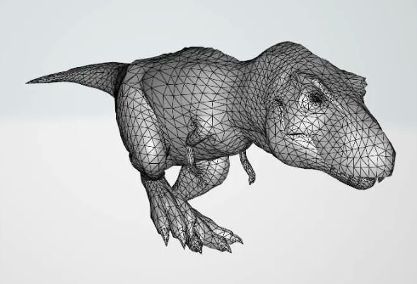

# 3DViewer v1.0

3DViewer v1.0 представляет собой инструмент для просмотра 3D моделей в каркасном виде на экране компьютера. Программа разработана на языке программирования 'C' с использованием структурного подхода и соблюдением стандартов Google Style.

## Contents

0. [Preamble](#preamble)
1. [Chapter I](#chapter-i)
   1.1. [Introduction](#introduction)
2. [Chapter II](#chapter-ii)
   2.1. [Information](#information)
3. [Chapter III](#chapter-iii)
   3.1. [Part 1. 3DViewer](#part-1-3dviewer)
   3.2. [Part 2. Дополнительно: Настройки](#part-2-дополнительно-настройки)
   3.3. [Part 3. Дополнительно: Запись](#part-3-дополнительно-запись)

## Chapter I

### Introduction

Программа 3DViewer предназначена для загрузки и просмотра каркасных моделей 3D объектов. Она позволяет пользователям загружать модели из файлов формата .obj и визуализировать их на экране с возможностью вращения, масштабирования и перемещения.

## Chapter II

### Information

Каркасная модель представляет собой объект в трехмерной графике, состоящий из вершин и рёбер, определяющих его форму и структуру в пространстве.

### Напоминание о структурном подходе

Программа разработана с применением структурного подхода, что включает в себя декомпозицию задач на меньшие части и иерархическое упорядочивание элементов программы.

### Формат представления описаний трехмерных объектов .obj

Файлы .obj представляют собой формат для описания геометрии трехмерных моделей, включая вершины, текстурные координаты, нормали и грани объекта.

## Chapter III

### Part 1. 3DViewer

Программа 3DViewer разработана на языке программирования C11 с использованием компилятора GCC. Код программы организован в структурную иерархию согласно принципам структурного программирования и стилю Google.

#### Основные функции программы включают:

- Загрузку каркасных моделей из файлов .obj.
- Возможность перемещения модели по осям X, Y, Z.
- Вращение модели относительно ее осей X, Y, Z.
- Масштабирование модели.

### Part 2. Дополнительно: Настройки

Программа предоставляет пользователю возможность настройки следующих параметров:

- Тип проекции: параллельная и центральная.
- Вид отображения ребер: сплошная, пунктирная.
- Цвет и толщина ребер.
- Вид отображения вершин: отсутствие, круг, квадрат.
- Цвет и размер вершин.
- Цвет фона.

Настройки сохраняются между запусками программы.

### Part 3. Дополнительно: Запись

Программа позволяет пользователю:

- Сохранять изображения в форматах BMP и JPEG.
- Записывать "скринкасты" - gif-анимации текущих пользовательских аффинных преобразований загруженной модели.

Программа разработана с учетом возможности корректного отображения моделей с различным количеством вершин до 1 000 000.
